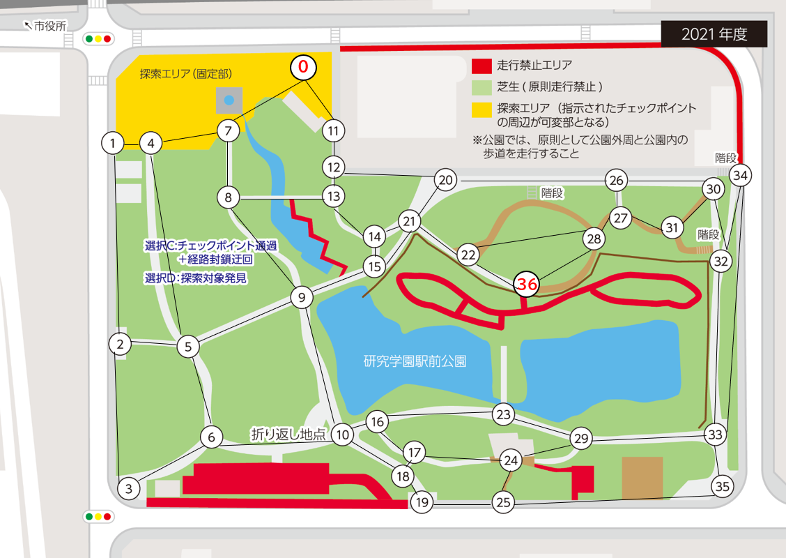

# tsukuba_challenge_cpp

## これは何？

2021/9/4 つくばチャレンジLT大会のネタです。
地図構築のデータ収集を効率化したいという動機で、つくばチャレンジ2019, 2021の公園内経路について、
- 巡回セールスマン問題の近似解を出力
- 中国人郵便配達員問題の解を出力

するプログラムを作りました。
実装には[NetworkX](https://networkx.org/)を使っています。

## 実行結果
```
python3 tc_tsp_cpp.py tc2019graph.txt
--- traveling salesperson problem ---
approx. TSP solution: [0, 11, 12, 13, 14, 15, 21, 20, 22, 36, 28, 27, 26, 30, 31, 32, 34, 33, 35, 29, 23, 16, 10, 18, 17, 19, 25, 24, 6, 3, 2, 5, 9, 8, 7, 4, 1, 0]
total cost: 2316.1000000000004

--- postman problem ---
odd degree nodes: [2, 4, 6, 7, 8, 12, 13, 14, 15, 16, 17, 18, 20, 22, 24, 25, 26, 27, 28, 29, 30, 32]
min weight matching of odd nodes: {(12, 20), (32, 30), (26, 27), (24, 29), (8, 13), (28, 22), (25, 18), (2, 6), (14, 15), (4, 7), (16, 17)}
original graph weight = 3420.8999999999996
append edges = [12, 20]
append edges = [32, 30]
append edges = [26, 27]
append edges = [24, 29]
append edges = [8, 13]
append edges = [28, 36, 22]
append edges = [25, 19, 18]
append edges = [2, 5, 6]
append edges = [14, 15]
append edges = [4, 7]
append edges = [16, 17]
total expanded weight = 4129.7
CPP solution [0, 11, 12, 20, 26, 30, 32, 34, 33, 35, 25, 19, 18, 19, 25, 24, 29, 24, 17, 16, 17, 18, 10, 16, 23, 29, 33, 32, 30, 31, 27, 26, 27, 28, 36, 28, 22, 36, 22, 21, 15, 14, 21, 20, 12, 13, 8, 13, 14, 15, 9, 10, 6, 5, 9, 8, 7, 4, 5, 2, 5, 6, 3, 2, 1, 4, 7]
circuit weight = 4129.700000000001
```

## 経路ファイルフォーマット
- 1行目 頂点数
- 2行目 辺数
- 3行目以降 頂点1, 頂点2, 距離

tc2019graph.txtには下記のように頂点と辺が設定されています。
距離は地図画像上で測ったもので適当な値です。


